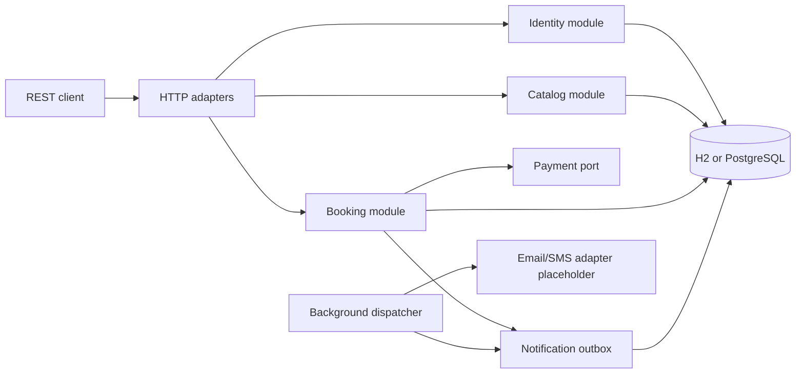

# Movie Ticket Booking System

A correctness-first REST API for browsing movie shows, holding seats, confirming payments, and
cancelling bookings under configurable refund policies. It supports multiple cities, theaters,
screens, pricing tiers, discount codes, customer/admin roles, and non-blocking notifications.

The design target is a modular monolith: simple to run and review, but with explicit business
boundaries and transaction rules that can evolve without turning the codebase into one large
service class.

## Highlights

- Seat-level inventory materialized per showing.
- Ordered JPA `PESSIMISTIC_WRITE` locking prevents double allocation.
- Five-minute holds are reclaimed lazily and by a scheduled sweeper.
- Idempotency keys make booking retries safe.
- Regular, premium, and local-weekend pricing is snapshotted when a showing is created.
- Percentage/fixed discounts use locked redemption counters.
- Configurable time-tiered refunds release cancelled seats.
- Confirmation, cancellation, and reminder events use a transactional outbox.
- Database-backed HTTP Basic authentication with `ADMIN` and `CUSTOMER` authorization.
- H2 for a zero-setup demo/tests and PostgreSQL support for a durable local database.
- Hibernate/JPA persistence with Flyway-owned schema validation and Open Session in View disabled.

## Quick Start

Prerequisite: Java 21 or newer. The Maven wrapper downloads Maven and project dependencies.

```bash
./mvnw spring-boot:run -Dspring-boot.run.profiles=demo
```

The API starts at `http://localhost:8080`. The demo profile uses an in-memory H2 database and
creates one city, theater, screen, movie, future showing, refund policy, and `WELCOME10` discount.

Seeded admin credentials:

```text
email:    admin@tickets.local
password: admin12345
```

Verify the service and discover demo IDs:

```bash
curl http://localhost:8080/actuator/health
curl http://localhost:8080/api/v1/cities
curl http://localhost:8080/api/v1/movies
curl http://localhost:8080/api/v1/showings
curl http://localhost:8080/api/v1/showings/1/seats
```

Register a customer:

```bash
curl -X POST http://localhost:8080/api/v1/customers \
  -H 'Content-Type: application/json' \
  -d '{"email":"customer@example.com","password":"customer123"}'
```

Then follow [api.http](api.http) in IntelliJ or VS Code REST Client for the complete booking flow.
For a click-through demo, import
[Movie Ticket Booking API.postman_collection.json](postman/Movie%20Ticket%20Booking%20API.postman_collection.json)
into Postman and run the numbered requests in `1 - Loom Demo Flow` from top to bottom.

## Run With PostgreSQL

Create an empty database named `movie_tickets`, then run:

```bash
DB_URL='jdbc:postgresql://localhost:5432/movie_tickets' \
DB_USERNAME='postgres' \
DB_PASSWORD='postgres' \
APP_ADMIN_PASSWORD='choose-a-strong-password' \
./mvnw spring-boot:run
```

Flyway applies the schema automatically. `APP_ADMIN_EMAIL` defaults to `admin@tickets.local`.
Demo catalog data is not loaded outside the `demo` profile.

## Tests

```bash
./mvnw test
open target/site/jacoco/index.html
```

The integration suite exercises catalog pricing, schedule conflicts, role boundaries, validation,
holds, payment rollback, booking idempotency, discount/refund calculations, expiry reclamation, and
a two-thread race for the same seat.

## Architecture



Code is grouped by business capability, then by adapter/application/domain responsibility. The
booking application service owns the atomic transaction that converts a hold into a paid booking;
Spring Data repositories generate routine persistence operations from method names. `@EntityGraph`
defines fetch plans and `@Lock` makes the few consistency-critical locks explicit, while the payment
gateway and notification sender remain ports with local adapters.

Detailed design:

- [Interactive data flow and concurrency guide](docs/data-flow.html)
- [System design and runtime flows](docs/architecture/system-design.md)
- [Data model](docs/architecture/data-model.md)
- [API reference](docs/api.md)
- [Architecture decisions](docs/architecture/decisions/)

## Project Layout

```text
src/main/java/com/mayankbhati/movietickets/
  identity/       accounts, current actor, security and Spring Data repository
  catalog/        catalog entities, use cases and Spring Data repositories
  booking/        booking aggregates, repositories, use cases and payment port
  notification/   outbox entity/repository, producer and dispatcher
  shared/         API errors and shared runtime configuration
src/main/resources/db/migration/   versioned database schema
src/test/java/                     integration and concurrency tests
docs/architecture/                 system design, data model and ADRs
```

## Core Invariants

1. One `show_seat` row is the source of truth for one physical seat in one showing.
2. A seat row can be `AVAILABLE`, `HELD`, or `BOOKED`; transitions occur inside transactions.
3. Contested seats are locked with `PESSIMISTIC_WRITE` in ascending ID order to serialize writers
   and reduce deadlocks.
4. A booking can only consume an active, unexpired hold owned by the authenticated customer.
5. `(customer_id, idempotency_key)` is unique, so a retried confirmation returns the first result.
6. Booking state and notification intent commit together through the outbox table.

## Assumptions and Scope

- Basic HTTP authentication is deliberate because OAuth/SSO/MFA are out of scope. Passwords created
  through the API are BCrypt encoded.
- The seeded admin account is for local evaluation only; override its password for persistent use.
- Money is stored as integer minor units. The sample uses INR, so `30000` means INR 300.00.
- Seat prices are snapshots. Later pricing-tier changes affect only newly created showings.
- A screen cannot have overlapping showings; movie duration defines the occupied interval.
- Weekend means Saturday or Sunday in the theater city's IANA timezone.
- Payment and notification delivery are replaceable mock/logging adapters. No external provider is
  contacted.
- Discount redemption is not restored after cancellation.
- A zero-percent cancellation is still recorded as a refund decision for auditability.
- List APIs are intentionally unpaginated at assignment scale.
- Deployment, containers, CI/CD, microservices, and production observability remain out of scope.
