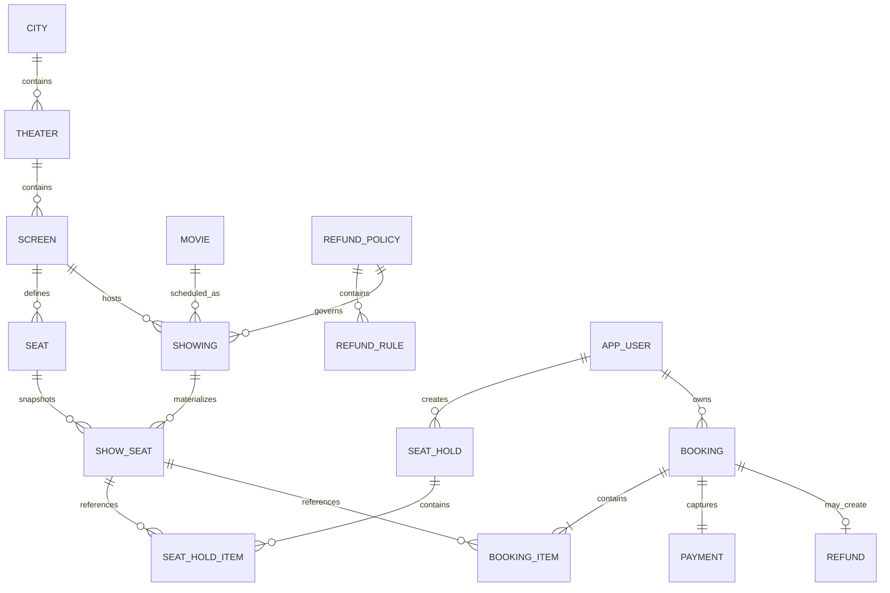
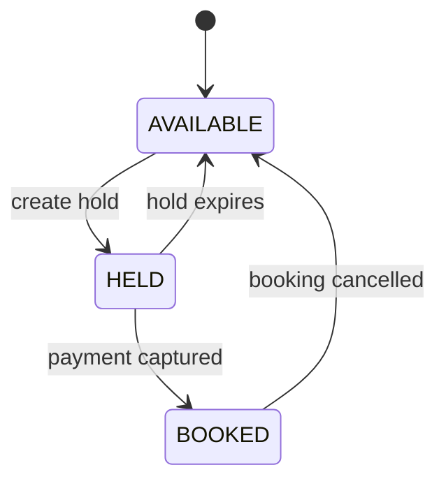

# Data Model

## Inventory State

`show_seat` is intentionally materialized when an admin creates a showing. It snapshots seat
category and price, and carries the mutable allocation state.

The database unique constraint on `(showing_id, seat_id)` guarantees exactly one inventory row for a
physical seat at a showing. Application transactions lock these rows before state transitions.

## Money and Time

- Monetary columns use integer minor units to avoid floating-point rounding.
- Pricing multipliers use basis points: `10000 = 1.00x`, `15000 = 1.50x`.
- Timestamps use `TIMESTAMP WITH TIME ZONE` and application calculations use an injected UTC clock.
- Theater-local weekend evaluation uses the city's IANA timezone.

