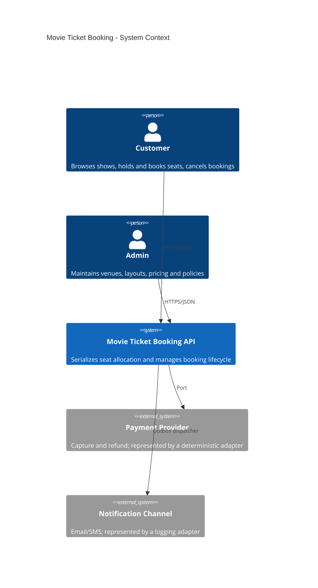
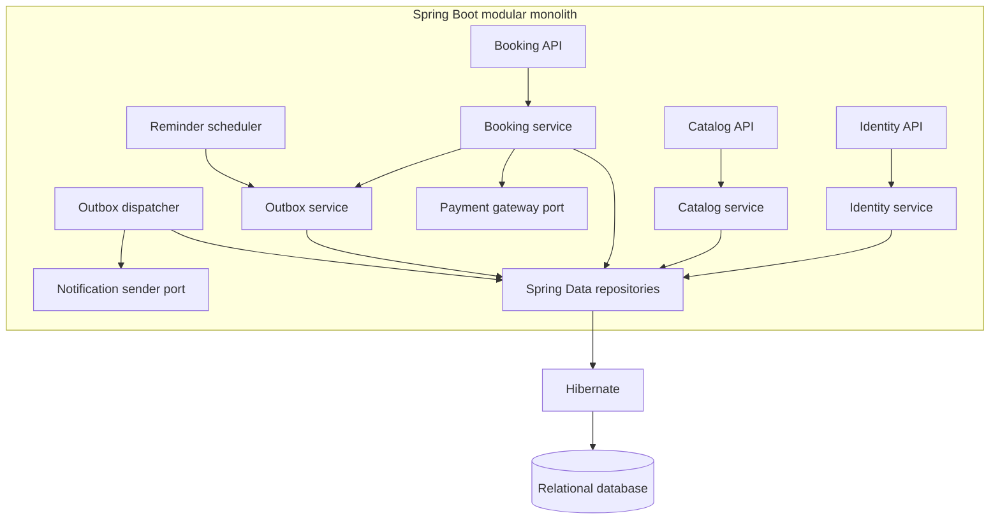
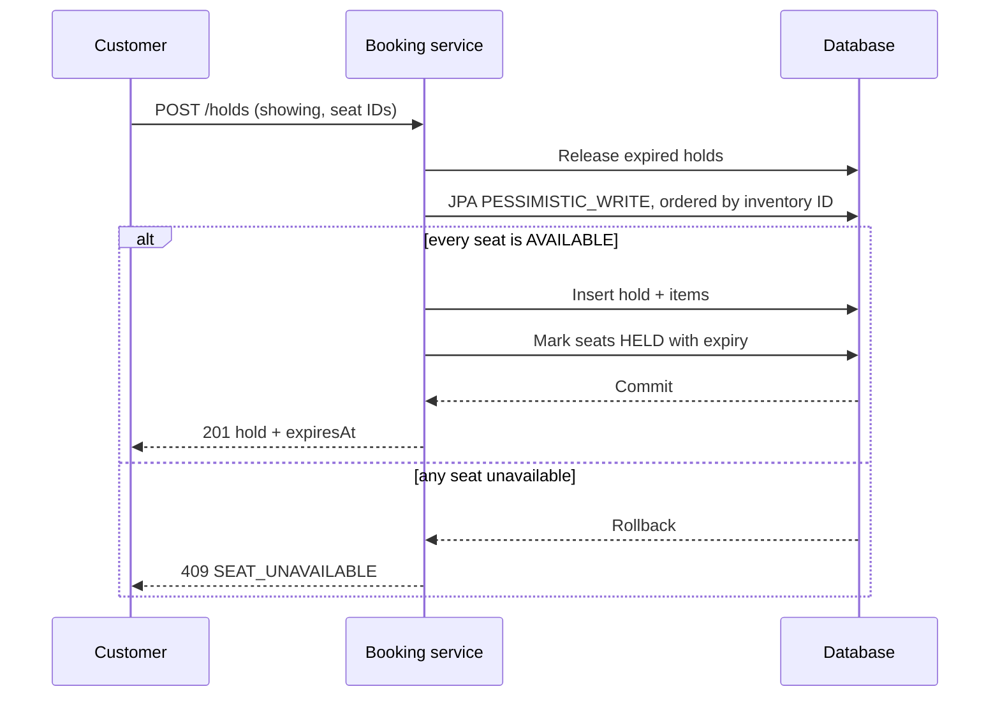
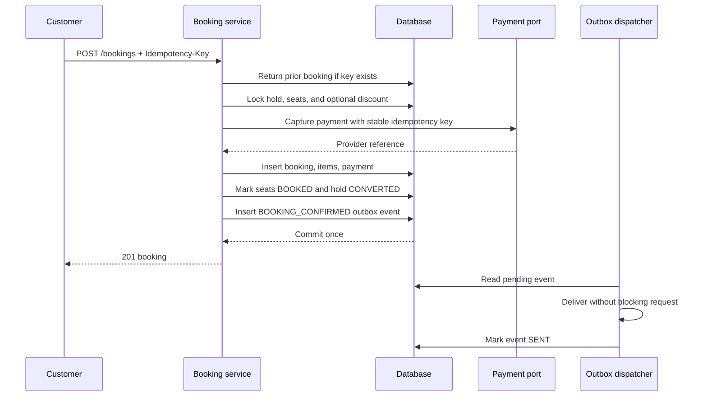

# System Design

## Context

## Modules

This is a single deployable process and one relational database. Feature packaging preserves clear
ownership without introducing distributed transactions or operational overhead that the assignment
does not require.

## Hold Sequence

Ordering locks by inventory ID gives concurrent transactions a consistent acquisition order. The
first contender changes the state while holding the row lock; a later contender sees `HELD` or
`BOOKED` after it acquires the lock and receives `409`.

## Booking Sequence

## Consistency and Failure Behavior

| Failure | Behavior |
|---|---|
| Two users hold one seat | Row lock serializes attempts; one succeeds |
| Hold expires | Lazy/scheduled cleanup returns inventory to `AVAILABLE` |
| Payment is declined | Transaction rolls back; the hold remains retryable |
| Client retries confirmation | Unique idempotency key returns the original booking |
| Notification sender fails | Booking remains confirmed; outbox retries independently |
| Cancellation succeeds | Booking, refund decision, released seats, and event commit together |

## Scaling Path

The current design scales vertically and through multiple stateless API instances sharing
PostgreSQL; row locks remain the serialization point. The next practical steps would be pagination,
read caching for catalog queries, partitioning old showing inventory, and a dedicated outbox worker.
External payment would require a pending-payment state plus webhook reconciliation. These are
documented paths, not partially implemented distributed machinery.
